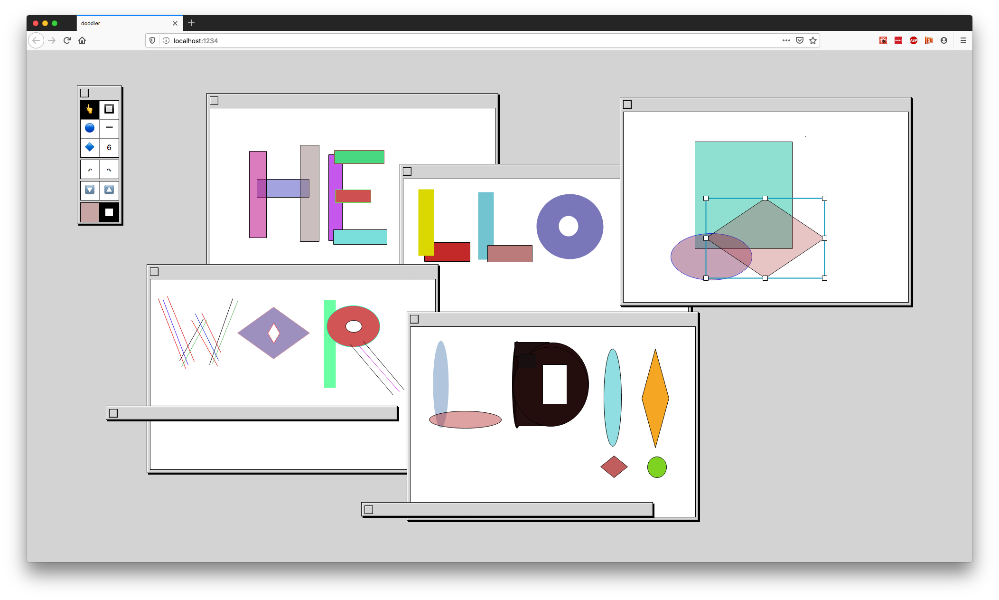

# doodler

Doodler is a small multi-window drawing app written in TypeScript. The app uses the [Gambar](https://github.com/jtanadi/gambar) library instead of interacting directly with the Canvas API. 

It's very much still a work-in-progres, but can be viewed [here](https://doodler-js.herokuapp.com).

