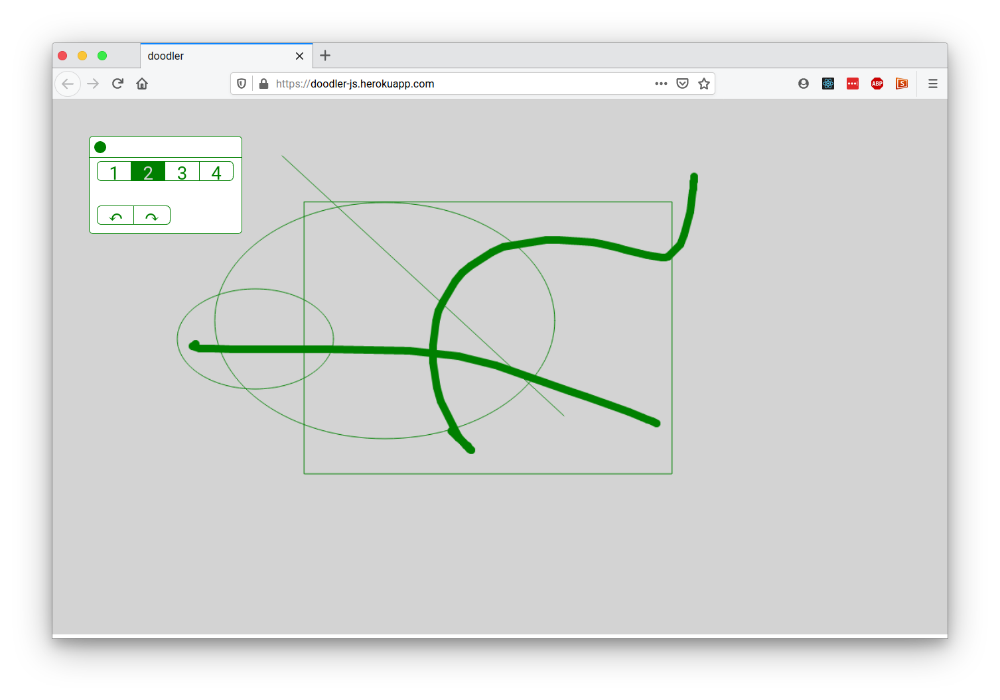

# doodler
Doodler is a small drawing app that implements the Canvas API. It's very much still a work-in-progres...




### Dev Notes
- Data model, so app state can be saved and loaded from localStorage:
```
{
    appName: string,
    version: string,
    savedDate: number,
    palette: {
        positionX: number,
        positionY: number,
        minimized: boolean
    },
    drawingObjects: [
        {
            shape: string,
            coordinates: [[x1, y1], [x2, y2], ...]
        },
        {
            shape: string,
            coordinates: [[x1, y1], [x2, y2], ...]
        }
    ]
}
```

